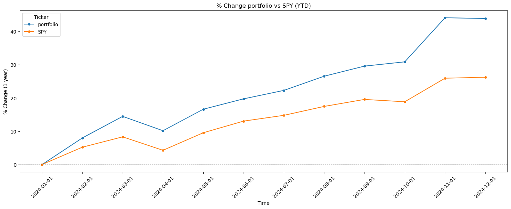

# Portfolio Optimization - IDS 789 Final Project
Adil Gazder, Chris Moreira, Danish Maknojia, Vishesh Gupta

## Overview

This project focuses on developing an investment portfolio optimization algorithm that iteratively selects stocks with the goal of maximizing Total Shareholder Return (TSR), optimizing volatility through equity beta, and determining stock allocations based on the equity ratings of each security analyzed. The final portfolio consists of 80 large-cap equities representing 8 distinct industries. Designed to maintain volatility lower than that of the S&P 500, the portfolio also incorporates algorithmic constraints to cap individual stock and industry weightings, thereby preserving diversification.

## Initial Algorithm Steps

1. **Normalize TSR**
   - TSR values are normalized to ensure consistent scoring across iterations.
   - The normalization process highlights cases where TSR becomes the primary factor over grading.

2. **Calculate Weights Across Investments**
   - Obtain a weight for each investment by calculating a ratio such that values fall between 0 and 1.
   - Perform basic normalization to standardize weights.

3. **Focus on Industry Allocation**
   - Evaluate the current weight allocated to each industry.
   - Ensure compliance with the default allocation threshold of 16% per industry.

4. **Calculate Portfolio Beta**
   - Determine the portfolio’s overall beta value.
   - Adjust weights to maintain a portfolio beta below 1.

## Issues Identified

1. **Random Weight Selection**
   - We are currently selecting weights that meet constraints but do not optimize for the lowest beta value. This may lead to suboptimal portfolio performance.

2. **Excessive Stock Weights**
   - Some stocks occupy more than 7% of the portfolio, exceeding acceptable limits. This requires further restrictions to ensure diversification.

3. **Industry Allocation Threshold Exceeded**
   - Weight rebalancing occasionally exceeds the 16% threshold for individual industries, violating the allocation constraints. Adjustments are necessary to maintain compliance.

## Updated Algorithm
- 15,000 iterations to generate portfolios and select the one with the lowest beta and highest returns
- Stock Weightage cap (<=4.5% of total portfolio) implemented
- Sector Weightage cap (<=16% of total portfolio) implemented

## Results

We compared the performance of the portfolio to the SPY over the YTD 2024 time period and saw that our portfolio (44% overall returns) out-performed the SPY (26% overall returns) with a mean monthly return (calculated MoM) as 4% and a standard deviation of 4.6%

